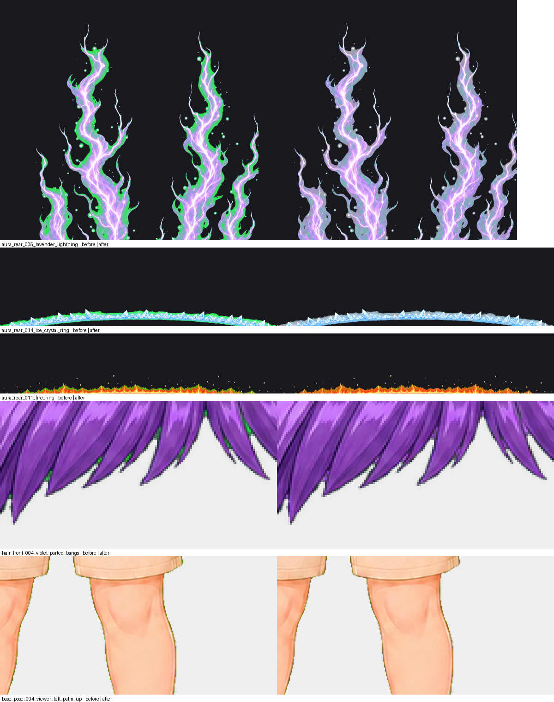

# Chroma-key residue removed — 2026-09-10

Thirty-four registered assets carried the green backdrop they were cut out of.
Not as an edge fringe — that had been dealt with — but as key colour surviving
**inside** the art, on every token those traits appear on.

The worst was `aura_rear_005_lavender_lightning`: 20.5 % of it was saturated key
green, tracing the outline of every lavender tongue, so the aura read as lime with
a violet core. Two green dots sat in the violet bangs. Green specks lay on the
base bodies' skin. A fire ring had a green rim.

## Why nothing caught it

Canvas size, alpha behaviour, maximum bounds and width ratio are all satisfied by
a layer with green confetti in it. The one chroma check the collection had
measured the silhouette's outer fringe — `outfit_005`'s manifest note is about
exactly that — and the interior was never looked at. It took rendering a sample
sheet and enlarging a face to see it.

## Telling residue from paint

The collection contains genuinely green art, so "is this pixel green" is not the
question. Two measurements were tried as discriminators and both failed on real
assets:

- **How much of the asset is green.** The lavender aura is 20.5 % key-green and
  all of it is residue; `base_pose_004` is 0.28 % and all of it is residue too.
  Share does not order the two cases.
- **How clustered the green is.** The laurel measures 0.314 on a local-density
  scale and the contaminated lightning ring 0.296; the emerald eyes measure 0.645
  and so does the contaminated lavender aura. The distributions overlap.

So the exemptions are a named list, made by rendering each asset that carries any
key-green against a dark ground and looking at it. Four are green by design: the
laurel wreath, the emerald eye pair, the procedurally built green neon ring, and
the verdant legendary. Everything else was residue. A guard refuses to touch an
unlisted asset that is more than 30 % key-green, so a future green trait fails
loudly rather than being quietly repainted.

## The repair

Three stages, in `scripts/despeckle_chroma_residue.py`. Each exists because the
stage before it was not enough:

1. **Follow the spill gradient.** Around every flagged pixel sits a skirt that is
   green by less than the detection margin. Cutting at the threshold left the
   lavender aura with a sage rim where the lime one had been — and worse, an
   unflagged pixel is held fixed and diffused *from*, so the skirt fed green back
   into the repair.
2. **Diffuse the surrounding art inward**, holding the known pixels fixed, over
   the residue's bounding box.
3. **Keep the original luminance and take only the colour from the diffusion.**
   Replacing the pixel outright flattened whatever shading the key sat on: the
   aura's tongues came back as smooth grey. Rescaling the diffused colour to the
   original brightness keeps the form and changes the hue, which is all that was
   wrong with it.

A short despill then clamps green to the larger of red and blue in the few pixels
around each repair, fading with distance. Alpha is never touched, so no silhouette
moves and no rig anchor changes.

`tests/test_chroma_residue.py` measures every registered asset and allows at most
8 key-green pixels outside the named exemptions, and separately asserts that each
exemption still names a real, still-green asset.

## Before and after

## Every asset repaired

| Asset | Key-green pixels | Share of the asset | Pixels repaired |
|---|---:|---:|---:|
| `rear_auras/aura_rear_014_ice_crystal_ring.png` | 7,253 | 25.799 % | 13,810 |
| `rear_auras/aura_rear_005_lavender_lightning.png` | 26,143 | 20.503 % | 48,687 |
| `rear_auras/aura_rear_012_lightning_ring.png` | 7,748 | 18.590 % | 14,819 |
| `rear_auras/aura_rear_011_fire_ring.png` | 1,876 | 7.629 % | 6,343 |
| `rear_auras/aura_rear_013_violet_flame_ring.png` | 808 | 2.433 % | 3,712 |
| `rear_auras/aura_rear_003_blue_crystalline_burst.png` | 965 | 0.763 % | 2,594 |
| `rear_auras/aura_rear_015_smoke_void_ring.png` | 151 | 0.521 % | 771 |
| `base_bodies/base_pose_004_viewer_left_palm_up.png` | 669 | 0.282 % | 4,061 |
| `base_bodies/base_pose_002_viewer_left_vertical_grip.png` | 511 | 0.209 % | 3,204 |
| `base_bodies/base_pose_003_viewer_right_vertical_grip.png` | 399 | 0.173 % | 2,648 |
| `base_bodies/base_pose_005_centered_two_hand_grip.png` | 311 | 0.138 % | 2,032 |
| `hair_front/hair_front_007_teal_open_center.png` | 74 | 0.084 % | 396 |
| `hair_front/hair_front_006_pink_soft_bangs.png` | 69 | 0.082 % | 386 |
| `hair_front/hair_front_004_violet_parted_bangs.png` | 62 | 0.080 % | 388 |
| `hand_objects/hand_object_007_gold_blue_gem_staff_pose_002_left.png` | 17 | 0.069 % | 105 |
| `hair_back/hair_back_006_pink_long_wavy.png` | 120 | 0.056 % | 770 |
| `rear_auras/aura_rear_017_water_splash_ring.png` | 9 | 0.049 % | 73 |
| `hair_front/hair_front_003_silver_straight_bangs.png` | 33 | 0.034 % | 263 |
| `hair_front/hair_front_001_gold_parted_bangs.png` | 14 | 0.024 % | 111 |
| `hair_back/hair_back_004_violet_long_wavy.png` | 62 | 0.022 % | 354 |
| `hair_back/hair_back_002_black_long_wavy.png` | 52 | 0.021 % | 439 |
| `hair_back/hair_back_007_teal_long_wavy.png` | 46 | 0.019 % | 192 |
| `hair_back/hair_back_001_gold_long_wavy.png` | 22 | 0.015 % | 204 |
| `hand_objects/hand_object_006_gold_lantern_pose_002_left.png` | 5 | 0.014 % | 36 |
| `outfits/outfit_008_olive_ragged_cloak.png` | 15 | 0.009 % | 164 |
| `hair_back/hair_back_008_red_long_wavy.png` | 12 | 0.007 % | 71 |
| `back_accessories/back_accessory_001_silver_feathered_wings.png` | 8 | 0.006 % | 103 |
| `hair_front/hair_front_008_red_short_bangs.png` | 4 | 0.005 % | 56 |
| `hand_objects/hand_object_008_blue_crescent_staff_pose_002_left.png` | 1 | 0.003 % | 14 |
| `hair_front/hair_front_005_blue_pointed_bangs.png` | 2 | 0.003 % | 25 |
| `back_accessories/back_accessory_005_black_violet_ragged_cloak.png` | 6 | 0.003 % | 70 |
| `outfits/outfit_005_sun_temple_pose_005.png` | 3 | 0.002 % | 23 |
| `outfits/outfit_010_celestial_robe_white_gold.png` | 1 | 0.001 % | 14 |
| `hair_back/hair_back_005_blue_long_wavy.png` | 2 | 0.001 % | 26 |
