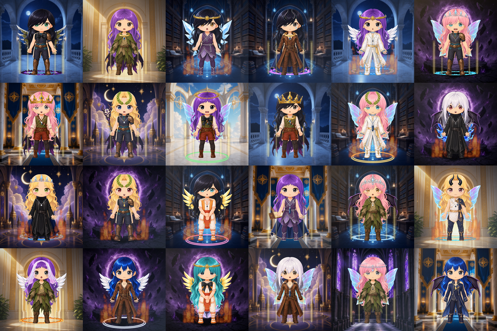

# Collection sample — 2026-09-09

Twenty-four tokens composed by `scripts/generate_777.py` at seed 20260910 from the
completed asset set, after the pose 005 proportion correction, the registration of
the 60 facial traits, the rebuilt front aura, and the chroma-residue removal.

    python scripts/generate_777.py --supply 24 --allow-nonstandard-supply --seed 20260910

All 16 layer categories are populated, so every token in this sheet carries a full
stack: background, rear aura, back accessory, rear hair, base body, outfit, neck
accessory, eyes, eyebrows, mouth, expression marks, front hair, head accessory,
hand object, front aura and global finish — with the optional categories present at
their configured rates.

## What to look at

- **Faces vary.** Iris colour, brow mood and mouth differ token to token, which is
  what the five newly registered categories buy. Before this pass every token in
  the collection wore the same painted face.
- **Nothing shows through.** No token shows the master's baked eyes, brows or mouth
  beside the trait that replaced them, and no skin patch reads as a patch.
- **The front aura is read through.** Where the rebuilt `aura_front_001` appears it
  licks up the figure without hiding it, and it never reaches the face. The first
  build of it passed every flatness measure and still shipped two orange rectangles
  over the character's legs; it took this sheet to see that, which is the argument
  for rendering one.
- **No green.** Thirty-four assets carried the chroma key they were cut out of,
  worst of all a lime rim around every tongue of `aura_rear_005_lavender_lightning`.
  It is gone from every token here.
- **Pose 005 matches.** Tokens on `base_pose_005` now carry the same head and face
  proportions as the other four bases.
