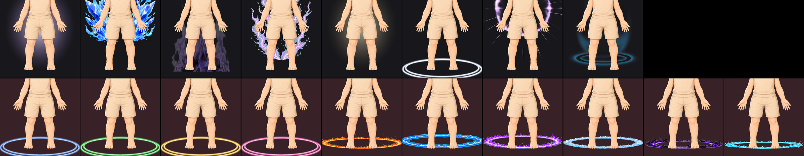

# Rear aura and wing count — 2026-09-10

Eighteen rear auras and eight back accessories were registered. Eleven traits
are retired, leaving eight auras and seven back accessories.

Top row: the eight auras kept. Bottom row, on the tinted ground: the ten
retired, all of them the same ellipse.

## Why

Eleven of the eighteen auras were one object — a flat ellipse on the floor
under the feet — in eleven colours: blue, green, gold, pink, white, orange,
another blue, violet, pale blue, another violet, cyan. Four of them carried a
texture on that ellipse (flame, arc, crystal, splash) but the ellipse is what
you see at the size a token is actually looked at. Eighteen auras over 770
tokens is about 43 each; eight is about 96.

The wings had the same problem once: `back_accessory_007_gold_luminous_wings`
is `back_accessory_001_silver_feathered_wings` in a different metal.

## Where the line is

A hard-edged shape is read by its outline, so a recolour of it is not a second
trait. That retires ten of the eleven rings and one of the two feathered wings.

A full-figure glow has no outline to read, so its colour is the whole of it.
`aura_rear_002_violet_radial_glow` and `aura_rear_006_gold_radiance` are the
same shape and both stay, because a token wearing one does not look like a
token wearing the other.

| Kept aura | Reads as |
|---|---|
| `aura_rear_002_violet_radial_glow` | a cool halo around the whole figure |
| `aura_rear_003_blue_crystalline_burst` | shards standing behind the figure |
| `aura_rear_004_violet_void_flame` | flame climbing the body, not a ring |
| `aura_rear_005_lavender_lightning` | arcs around the whole figure |
| `aura_rear_006_gold_radiance` | the warm counterpart to the violet halo |
| `aura_rear_010_white_neon_ring` | the one floor ring, in the colour that sits under any palette |
| `aura_rear_016_cosmic_sparkle_ring` | upright behind the torso, with rays |
| `aura_rear_018_blue_flame_ring` | raised off the floor and burning |

The retired ten are `aura_rear_001`, `007`, `008`, `009`, `011`, `012`, `013`,
`014`, `015`, `017`, plus `back_accessory_007`.

## What was left at its current count

- **Hand objects, twelve.** Five are staves, but a staff is read by its head,
  and a crystal, a gold gem, a crescent and a horned skull are four different
  heads. About 64 tokens each.
- **Back accessories, seven after the retirement.** Feathered, bat, fairy,
  crystal and plated wings are five different outlines; the cape and the
  ragged cloak are two more.

## What happened to the art

Nothing was deleted. The eleven files moved to
`incoming/effects_retired_2026-09-10/`, their manifest entries moved to
`blocked_assets` with the reason and the SHA-256 they were retired at, and
their backlog rows are marked `QA-failed`. A replacement is welcome as a shape
that is not already in the set; another colour of a registered ring is not.

`scripts/despeckle_chroma_residue.py` also drops its green-by-design exemption
for the retired green ring, so the chroma gate keeps no hole where an asset
used to be.
