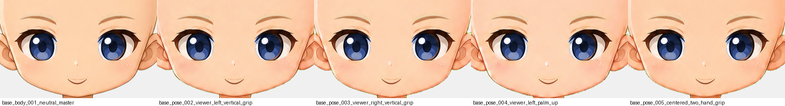
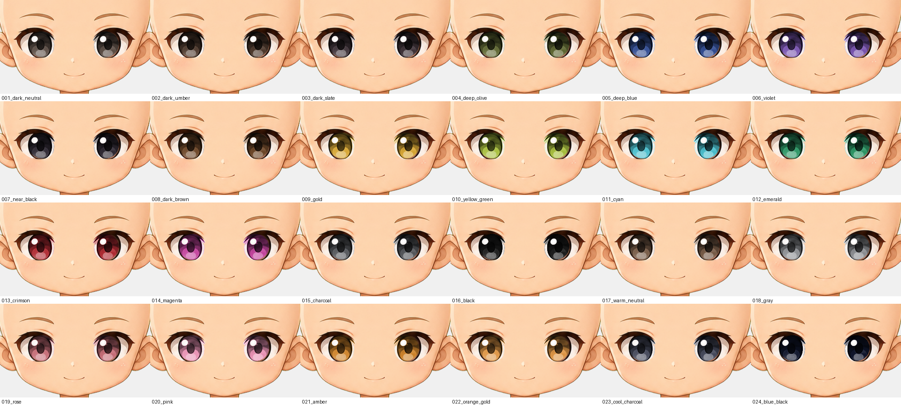
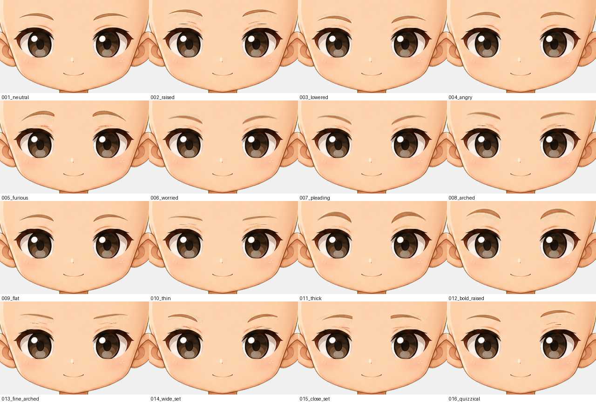
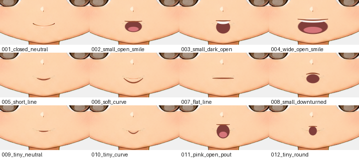
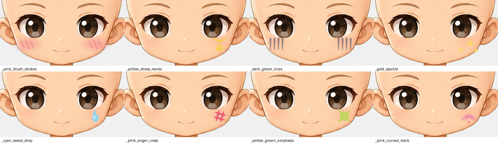

# Facial traits — 2026-09-09

The last five pending categories are registered: 24 eye pairs, 16 eyebrow pairs,
12 mouths, 8 expression marks and the rebuilt front aura. All 16 categories are
now complete.

## Why the family is built from the master rather than the sheet

The backlog cites cells of a `FACE` reference sheet for all 60 facial traits. That
sheet exists in this repository only as
`images/reference_sheets/anime_character_creation_asset_sheet.webp`, which is
**128 × 96 px** — a browsing preview, as `images/reference_sheets/index.md` says of
all of them. A 1254 px eye pair cannot be reconstructed from a thumbnail, and
naming the output `eyes_001_sheet_r1c1_dark_neutral.png` would put a provenance
claim in the manifest that the file could not support.

The approved face was used instead, and it is the better source anyway. The base
body is not a blank mannequin: `prompts/16` specifies "large warm-brown eyes,
small nose, and gentle closed-mouth smile", and every registered base has them
painted in. That face is on-model, on-rig, in the locked style, and positioned by
the artist rather than by a placement rule. The backlog rows now carry the real
filenames, and every manifest entry records why the cell reference was dropped.

## The consequence nobody had written down

A face trait does not sit on an empty face. It **replaces** one. A trait smaller
than the baked feature leaves the original showing beside it, and no gate in the
collection could see that: a layer that covers nothing still passes canvas, alpha,
bounds and width-ratio checks.

So every eye, eyebrow and mouth layer carries a feathered skin patch beneath its
art, shaped to the union of where the baked feature lands across **all five**
registered bases. The patch colour is the harmonic reconstruction of the skin
behind the feature, so it is continuous with the cheek and forehead rather than a
flat fill. `tests/test_face_traits.py` measures the coverage on every registered
asset: 0 uncovered pixels required, and 0 measured on all 52.

Expression marks carry no patch. They are additive overlays on skin that is
already there, and a patch on one would erase whatever it sat over — which the
tests also assert.

## How each family varies

**Eyes.** The master's eye pair, separated from the skin it is painted on by
`scripts/extract_face_features.py`, with the iris remapped through a three-stop
ramp. The lash line, sclera and the shared upper-left catchlight are the master's
own, so the pair stays on-model; only the iris body changes colour, and the ramp
keeps the pupil dark and the rim light where the painting put them.

The backlog repeats three adjectives across its rows — "dark neutral" at r1c1 and
r3c1, "charcoal" at r2c7 and r3c7, "black" at r2c8 and r3c8. Shipping two identical
eye pairs under different filenames would be two trait values a holder cannot tell
apart, so the repeats are separated by temperature, and both the palette table and
the shipped pixels are asserted distinct.

**Eyebrows.** The master's brow pair, remapped per column: how high it sits, how
far the inner end lifts or falls, how much of the painted arch is kept, and how
heavy the line is. Two things were needed to make that clean, and both are
recorded because both were failures first:

- The brow's centre line is a weighted cubic fit through the per-column centroids,
  not the centroids themselves. Reading them directly gives a line that jitters by
  a pixel wherever a column carries few faint pixels, and every transform rescales
  about it — so the jitter came out as a comb along the brow.
- The transform runs on the brow's **difference from the skin behind it**, not on
  its separated alpha and colour. Minimum-alpha separation gives a soft edge pixel
  a low alpha against an extreme colour; the pair composites back exactly, but
  resampling the two independently breaks the cancellation, and the first attempt
  hung a cream halo over every brow it moved.

The style also paints a pale warm highlight along the top of each brow. It is light
enough to pass the skin test, so holding it fixed diffused its brightness across
the whole reconstruction and the patch came out lighter than the forehead around
it — visible as a pale crescent wherever the trait's own brow no longer covered it.
Skin near a feature varies smoothly by a few units; the highlight runs 13–17 above.
`known_skin()` excludes that bright tail, which puts the highlight where it belongs:
in the feature that moves with the trait.

**Mouths.** Drawn with soft round brushes in the master's own mouth-line colour,
calibrated to the painted mouth: X 605–650, dropping 7 px from end to centre.
`mouth_001_closed_neutral` is that painted mouth itself rather than a redrawing of
it. Mouths render above the eyes layer, so none may put ink over the eyes; measured
0 on all 12.

**Expression marks.** Drawn accents on the cheeks. Two constraints fix the
placement: `hair_front` renders above expression marks, so anything on the forehead
would be hidden by most of the hair in the collection; and the face narrows fast
below the eyes — X 492–763 at Y 422, X 524–731 at Y 446 — so a mark much outside
these anchors lands on the ear or off the silhouette. The first pass put six of the
eight on the ear.

Expression marks are optional at a rate of 0.3: most faces carry none.

## Evidence

Every base body, one face trait set — the check that the shared layers land the
same way on all five, which is what the pose 005 proportion correction earlier the
same day was for:

24 eye pairs:

16 eyebrow pairs:

12 mouths:

8 expression marks:

