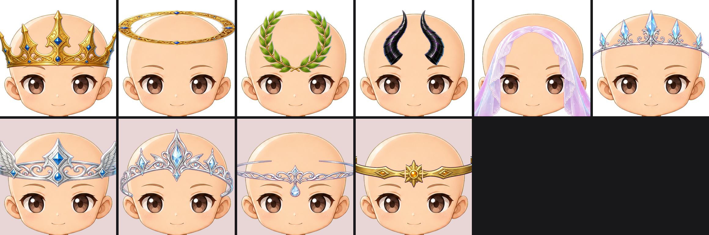

# Head accessory count — 2026-09-10

Ten head accessories were registered. Four are retired, leaving six.

Top row: the six kept. Bottom row, on the tinted ground: the four retired.

## Why

Ten accessories over 770 generative tokens is about 42 tokens each, and five of
the ten were the same object — a band across the forehead. What separated them
was filigree, which is not visible at the size a token is actually seen. A
holder comparing two of them could not name the difference.

The six kept each read differently in silhouette alone: a pointed crown, a ring
floating clear of the head, an open wreath, horns, a drape down both sides, and
one band whose crystal points break its own line. That is a real choice per
token, and it takes each remaining accessory from about 42 tokens to about 71.

| Kept | Reads as |
|---|---|
| `head_accessory_001_gold_pointed_crown` | pointed crown, tall silhouette |
| `head_accessory_002_gold_halo` | a ring clear of the head |
| `head_accessory_003_laurel_wreath` | open at the top |
| `head_accessory_004_dark_curved_horns` | reads from the outline alone |
| `head_accessory_008_lace_veil` | a drape down both sides |
| `head_accessory_009_crystal_spiked_tiara` | the one band with a shape of its own |

| Retired | Why this one |
|---|---|
| `head_accessory_005_silver_winged_circlet` | silver forehead band; the wings read as filigree at token size |
| `head_accessory_006_silver_ornate_tiara` | silver forehead band, the most ornate of four alike |
| `head_accessory_007_silver_drop_circlet` | silver forehead band with a drop |
| `head_accessory_010_gold_low_circlet` | gold forehead band |

## What happened to the art

Nothing was deleted. The four files moved to
`incoming/head_accessories_retired_2026-09-10/`, their manifest entries moved to
`blocked_assets` with the reason and the SHA-256 they were retired at, and their
backlog rows are marked `QA-failed`. A later pass can bring one back if a
distinct design is wanted in its place.

The neck accessories were withdrawn separately on the same day for a different
reason — they did not sit on the neck. See
[neck_accessories_withdrawn_2026-09-10.md](neck_accessories_withdrawn_2026-09-10.md).
