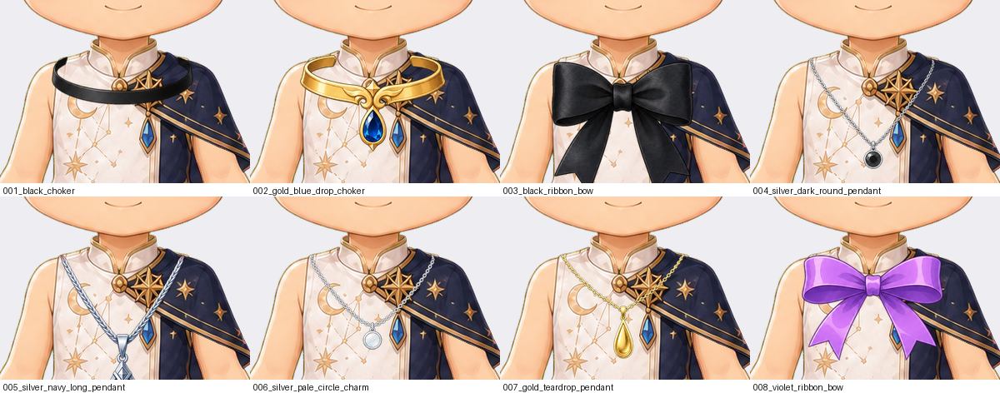

# Neck accessories withdrawn — 2026-09-10

All eight neck accessories are out of `assets/`. Rendered at full size over an
outfit, none of them is neckwear.

The chokers are chest-wide bands lying across the collarbones and over the
garment's own collar. The two bows cover the whole upper chest. The four pendants
hang from points outside the neck entirely, resting on the shoulders. They are
ornaments at roughly twice the scale the anatomy takes.

## This was the third pass

The first found the category seated at Y 545–555, mid-chest, and moved it to the
throat. The second found the pieces were 150–175 px wide against a 61 px neck, so
the chain ends hung in open air either side of it, and re-seated each one at the
row where its own topmost ink lands inside the silhouette. Both passes were
fixing **where** the pieces sit, and both left this untouched.

Nothing measured caught it, and the seating tests written after the second pass
would have passed on these files too, because they measure position. What is
wrong is size: a 150–175 px ornament cannot be seated onto a 61 px neck. That
needs the eight designs redrawn, not re-placed.

## What a replacement has to satisfy

The base body's neck is 61 px across at Y 482 and spans Y 476–496 from chin to
shoulder junction. A choker is a band no wider than the neck plus a few pixels of
wrap. A pendant's chain must start inside the neck silhouette, and its drop hang
on the chest below Y 520, clear of an outfit's collar.

`tests/test_trait_seating.py` now measures width against the neck rather than
position, so a re-registered piece at this scale fails before review. It also
asserts that the eight withdrawn records keep their reason and their retained
bytes, so the category is not quietly forgotten.

The bytes are retained at `incoming/neck_accessories_withdrawn_2026-09-10/` and
the manifest carries each one's hash. Backlog rows DG-047 to DG-054 are back to
`QA-failed`.

`scripts/deregister_neck_accessories.py`.
