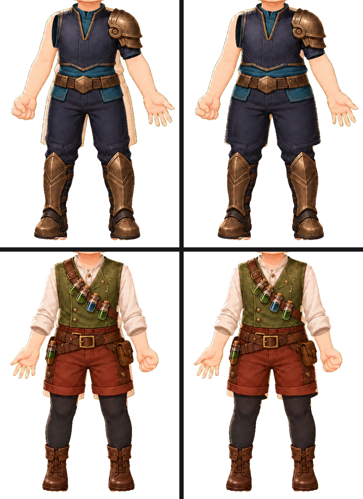

# Outfit body fit — 2026-09-10

The base bodies wear a cream tank and shorts. Two outfits were drawn narrower
than that body and showed it. Both are fixed in the garment layer.

Left: before. Right: after. Top `outfit_002`, bottom `outfit_003`.

## What was wrong

On `outfit_002_storm_guardian` a cream band ran from the armpit, down the
outside of the hips and thighs, to below the knee on both sides. It read as
underwear sticking out of the armour, and it was on every token that outfit
appeared in. On `outfit_003_verdant_alchemist` the shorts showed at both hips.

| Asset | Base body showing before | After |
|---|---|---|
| `outfit_002_storm_guardian_pose_002` | 7745 px | 449 px |
| `outfit_003_verdant_alchemist_pose_003` | 2236 px | 1190 px |

Nothing could see it. The neckline gate measures a window across the chest, so
a garment can miss the body's sides by 20 px and pass; canvas, alpha, bounds
and the width ratio are all satisfied by a garment that is simply too narrow.
It was found by rendering each outfit over its bound base.

## The repair

`scripts/fit_outfit_torso.py` reads the base body's own runs per row — the
torso above the hips, the two legs below — and closes what shows beside the
garment. Where the garment is narrower than the body it warps its edge out,
carrying the contour line as a rigid block and taking up the difference on a
ramp behind it. Where the strip has garment on both sides, which is what an
armhole that does not meet the coat looks like, it fills between them instead
and leaves every drawn line where it is.

The strip is followed down the body as a chain rather than grouped by side, so
the outer edge of a hip carries on as the outer edge of a leg. Grouping by side
broke the chain where the hips split into two legs and the taper at that false
end left a notch of bare hip.

Semi-transparent fabric counts as covered. Reading a translucent drape as bare
body warped the sun temple tunic's side panels into hard-edged blocks.

## The eight outfits this does not touch

Moving a garment's edge means stretching the fabric behind it, and that is only
safe where the fabric is plain. On a coat it drags a lapel, a belt end or a
trim line out with the edge. Every one of the other eight was run, rendered and
rejected by eye: `outfit_009`'s coat front tore, `outfit_010`'s sash moved and
narrowed, `outfit_005`'s hem trim was destroyed, `outfit_006`'s skirt slimmed
and grew pale seams at the waist.

They are named in the script's `FITTED` map by omission, and a plainness gate
inside the script catches most such edges on its own and reports them as *left
alone behind structured fabric* rather than tearing them.

What remains on those eight is a strip at the waist and hip of 8–20 px, most
visible on `outfit_009` and `outfit_010` where the base body's tank shows
between the coat's body and its own sleeve. Closing those needs the garment
redrawn at the body's width, not warped — the fabric beside the strip carries
the structure that a warp would move.

## Gate

`tests/test_outfit_body_fit.py` measures what shows beside the two fitted
outfits and allows 1400 px, which is what easing a warp in and out of its run
leaves. Against the pre-repair assets it reports 7745 px and 2236 px.
