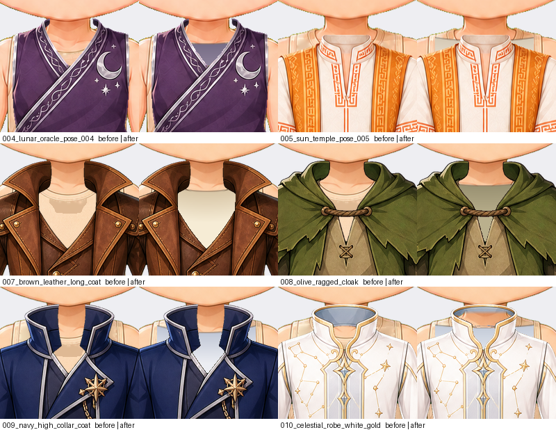

# Outfit necklines — 2026-09-10

Six outfits were showing the base body's undergarment through their own opening,
and one had its collar painted shut. Both are fixed in the garment layer, so the
repair travels with the outfit rather than depending on what is under it.

## What was wrong

The base bodies wear a neutral tank. Where an outfit is cut open at the chest it
showed through: a flat cream panel with the tank's own neckline shading crossing
it as a hard horizontal step, framed by the garment's lapels. On `outfit_010` the
stand collar's interior was painted as a flat slate disc, and because the outfit
renders above the base, the disc hid the neck and the collar read as an empty tube
with a lid.

`base_body_001`'s manifest note had already recorded the first diagnosis and
declined the fix: "covering those needs the outfit to carry its own inner garment,
which is a re-render, not an edit." It is neither. The garment can be painted into
the opening.

## The repair

Each outfit that opens at the chest gets an inner garment: a shaded shirt filling
the opening below a neckline stated per outfit, in a colour chosen against that
outfit. `outfit_010` also has its collar interior cleared where the neck rises
through it, keeping a crescent at the top as the collar's far wall.

| Outfit | Inner garment |
|---|---|
| `outfit_004_lunar_oracle` | muted violet-grey underlayer inside the wrap |
| `outfit_005_sun_temple` | warm cream underlayer inside the tunic's round neck |
| `outfit_007_brown_leather_long_coat` | cream linen under a brown leather coat |
| `outfit_008_olive_ragged_cloak` | olive linen tunic under a ragged cloak |
| `outfit_009_navy_high_collar_coat` | pale grey-blue shirt under a navy coat |
| `outfit_010_celestial_robe_white_gold` | collar opened, pale shirt inside it |

## Three approaches that did not work

Recorded because each looked right in the code and wrong on the character.

1. **Neckline pulled to the tank column by column.** It followed the detection's
   noise: the shirt came out with a torn, stepped top edge and vertical streaks
   where neighbouring columns disagreed.
2. **Painting exactly the detected tank.** The tank's boundary is speckly, so the
   shirt gained a mottled band along its top. It was also not idempotent — the
   region was found by a flood fill seeded at the lowest transparent pixel, so
   painting part of it moved the seed and the next measurement came back *higher*.
3. **Filling the "gaps" at the shoulders with diffused fabric.** Skin and the tank
   overlap so far in tone that a lit highlight on a bare shoulder passes the tank
   test — measured against the whole silhouette it reported 2,661 px on
   `outfit_002`, which has no opening at all. Filling those smeared dark blotches
   up both arms of `outfit_004` and `outfit_005`.

The shirt is now bounded by a neckline written down per outfit and by the torso
window between the arms, not by a colour test. Every measurement here is confined
to that window for the same reason.

## Left as designed

`outfit_006_black_layered_hooded_robe` closes over the whole neck. Cutting an
opening into it was tried and gave a rectangular window through the cowl: the
hood's art has no neckline in it to reveal. A high cowl closing at the jaw is a
garment, where `outfit_010`'s painted-shut collar was a stand collar that visibly
should have been open. It is named as an exception in the test with that reason.

## Verification

Tank visible through the opening, inside the torso window, per outfit:

| Outfit | Before | After |
|---|---:|---:|
| `outfit_004_lunar_oracle` | 112 | **0** |
| `outfit_005_sun_temple` | 212 | **4** |
| `outfit_007_brown_leather_long_coat` | 1,183 | **26** |
| `outfit_008_olive_ragged_cloak` | 428 | **6** |
| `outfit_009_navy_high_collar_coat` | 918 | **27** |
| `outfit_010_celestial_robe_white_gold` | 141 | **4** |

`tests/test_outfit_necklines.py` allows 40, and separately asserts that no collar
caps the neck.

`scripts/fix_outfit_necklines.py`.
