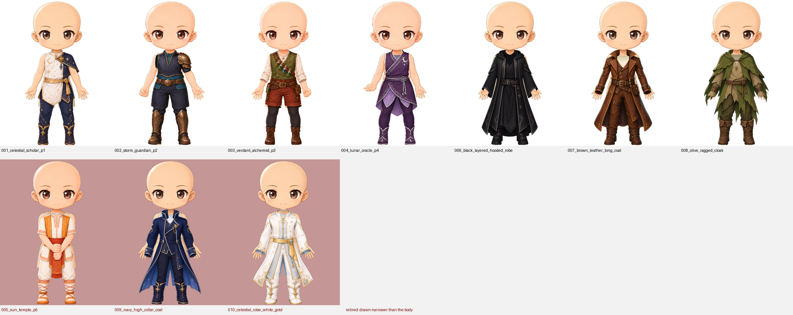
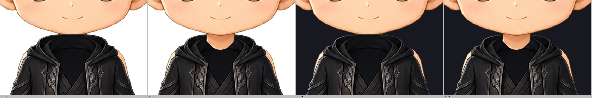
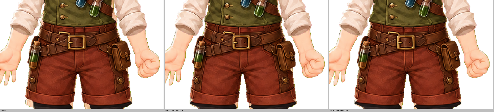

# Outfit refit — 2026-09-10

The remaining eight outfits were drawn narrower than the base body they are worn
over, so the cream tank and shorts showed beside the garment. Three are
withdrawn, one had its neck opened, and the widening this pass was supposed to
deliver was built four different ways and rejected each time on the render.

Top row: the seven outfits kept, each over its bound base. Bottom row, on the
tinted ground: the three withdrawn.

## What the measurements actually said

The torso and leg shortfall in `docs/handoff/outfit-refit-brief.md` reproduces
exactly against what is on disk, every outfit, to the pixel. Its **shoulder**
table does not, and two of its rows are counting the neck rather than a
shoulder:

| Outfit | Brief | Bare shoulder with the neck column excluded |
|---|---:|---:|
| `outfit_005_sun_temple` | 3747 | 2838 |
| `outfit_009_navy_high_collar_coat` | 3152 | 2312 |
| `outfit_010_celestial_robe_white_gold` | 2878 | 2026 |
| `outfit_007_brown_leather_long_coat` | 1813 | 804 |
| `outfit_006_black_layered_hooded_robe` | 397 | 439 |
| `outfit_003_verdant_alchemist` | 882 | **0** |
| `outfit_008_olive_ragged_cloak` | 894 | **0** |

`outfit_003` and `outfit_008` have no shoulder crescent at all; their shoulders
are covered and what the brief measured is the neck, which is meant to show.
`outfit_005` has the largest one, and its tunic has a drawn short sleeve below
it, so its shoulders are not the design choice the brief listed them as. That
made five sleeved garments with a bare shoulder rather than four.

Separately, where the cream tank and shorts were actually visible, measured with
a mask grown along the undergarment's own shading so the lit face of the tank is
found as well as its shadowed side:

| Outfit | Undergarment showing |
|---|---:|
| `outfit_010` | 2680 |
| `outfit_009` | 2671 |
| `outfit_005` | 2067 |
| `outfit_007` | 975 |
| `outfit_003` | 659 |
| `outfit_001` | 536 |
| `outfit_004` | 442 |
| `outfit_002` | 358 |
| `outfit_006` | 122 |
| `outfit_008` | 0 |

## The neck on outfit_006

The hooded robe had no neck. The cowl's opening was filled with a flat
near-black shape — values around (17,18,21), with no fold, seam or shading
anywhere in it — whose top arc reached y475 against a chin at 476.5. It covered
the neck completely and met the jaw, so the head read as sitting on a black
dome.

`docs/qa/outfit_necklines_2026-09-10.md` had declined this one, on the grounds
that a high cowl closing at the jaw is a garment rather than a defect. Rendered
over the base and enlarged it is neither. It is the same sealed interior
`outfit_010`'s stand collar had, in a hood, and it takes the same cut:
`scripts/open_collar.py` with the cowl's rim traced from the art at
`rim_centre 510, rim_rise 20, half 30`.

The rim's ends land on the neck's own silhouette where it flares into the
trapezius at about y490, so the opening closes on drawn anatomy. Three wider
arcs were tried first — `c504 r10 h32`, `c508 r13 h33`, `c514 r16 h34` — and all
three left a soft notch at each side of the neck's base, where the cut's wall
crossed the flare with nothing to meet. 1768 px cleared; nothing else in the
garment is touched. `outfit_006` is no longer an exemption in
`tests/test_outfit_necklines.py`.

## The three that are withdrawn

`outfit_005_sun_temple_pose_005`, `outfit_009_navy_high_collar_coat` and
`outfit_010_celestial_robe_white_gold` are retired to
`incoming/outfits_retired_2026-09-10/`, their manifest entries moved to
`blocked_assets` with the SHA-256 they were retired at, and their backlog rows
marked `QA-failed`.

On `outfit_009` and `outfit_010` the tank ran 14–22 px wide from the armpit past
the hip on both sides, between the garment's body and its own sleeve. On
`outfit_005` the tunic was 12–16 px inside the silhouette down both flanks and
both tank straps showed above the shoulder line. In each case the fabric beside
the strip carries the structure — a belt, a sash, a hem trim — that a widening
would have to move.

`base_pose_005_centered_two_hand_grip` goes with them. Outfits are not an
optional category and `outfit_005` was the only outfit bound to that pose, so
with the outfit gone the generator can build no valid token on it. Nothing is
wrong with the pose. `tests/test_outfit_body_fit.py` now asserts that no
registered base is left without an outfit, so the next withdrawal cannot strand
one quietly.

Two of the four assets carry no `backlog_id` in the manifest —`outfit_005` and
`base_pose_005` — so `scripts/retire_narrow_outfits.py` matches backlog rows by
asset path. An id-based update would have skipped both and left the ledger
claiming they were still registered, which is the failure the rear auras hit.

## Four widenings that did not work

The pass was asked to widen the garments slightly rather than withdraw them.
Each of these was built, run and rendered over the bound base at 3× or more.

1. **A per-row blend across the strip, between the fabric on each side.** Each
   row gets its own pair of endpoints, so any row-to-row noise in the sample
   becomes a horizontal stripe: the strip came out banded, and it closed only
   the rows that passed the chain test, leaving cream above and below the fill.
2. **A Laplace solve over the strip as one region**, with boundary values read
   from the garment eroded by 3 px so they are fabric rather than contour. It is
   smooth, and it is a blur: on `outfit_007` the flank filled with a soft brown
   membrane that carried none of the leather's shading and read as a smear
   beside it. It also under-covered, because the tank mask it was bounded by
   found only the shadowed face of the tank.
3. **Warping the plainer of the strip's two sides across it** with
   `widen_sleeves.warp_row`, choosing per strip which side moves so the edge
   that moves is never the one with a belt behind it. This is the closest to
   right and it still fails. With the warp's stretch reaching 90 px into the
   garment, `outfit_003`'s belt buckle grew and shifted and its hip pouch moved
   outward.
4. **The same warp with the stretch confined to 30 px and then 20 px**, to keep
   it away from the structure further in. The belt, the buckle and the pouch
   still move, because on this art they sit within 20 px of the edge that has to
   move.

Left: `outfit_003` as drawn. Middle and right: the same garment after the warp,
at 30 px and 20 px of reach. The belt is fatter, the buckle is larger and has
moved, the pouch has grown and shifted outward, and the hip is wider. The strip
is closed and the garment is a different garment.

That is the same wall the five repairs before this one hit, and it is worth
stating plainly rather than as a preference: on these garments the fabric that
would have to stretch is the fabric that carries the drawn structure, so there
is no widening of the edge that leaves the silhouette, the trim and the belt
where they are. Closing these strips needs the art redrawn at the body's
measured width. Nothing was written to `assets/` from any of the four.

## What is still showing

Honestly, on the seven that are registered:

| Outfit | Undergarment showing | Reads as |
|---|---:|---|
| `outfit_007_brown_leather_long_coat` | 975 | a cream band down the viewer-left flank, armpit to hip, clearly visible at 1× |
| `outfit_003_verdant_alchemist` | 659 | slivers at both hips and below the shorts' hem |
| `outfit_001_celestial_scholar` | 536 | slivers at both hips |
| `outfit_004_lunar_oracle` | 442 | a sliver at the waist beside the wrap, and the tank strap on the viewer-left shoulder |
| `outfit_002_storm_guardian` | 358 | traces at the hip |
| `outfit_006_black_layered_hooded_robe` | 122 | a pale trace at each flank, plus a bare shoulder crescent that is skin, not tank |
| `outfit_008_olive_ragged_cloak` | 0 | clean |

`outfit_007` is the one that still fails the bar. It is left rather than
widened, because widening it moves its belt.

## Gates

- `tests/test_outfit_body_fit.py` now measures **every** outfit rather than the
  two in `fit_outfit_torso.FITTED`, at 2700 px. That number describes the art
  that is registered — `outfit_007` measures 2567 and the rest fall between 40
  and 2205 — and it is not a target. It also asserts the three withdrawn outfits
  stay withdrawn with their reason, requirement and retirement hash, and that no
  registered base is left with no outfit bound to it.
- `tests/test_outfit_necklines.py` measures `outfit_006` alongside the rest now
  that its cowl is open.
- `tests/test_trait_seating.py` no longer asserts that a withdrawn asset's bytes
  are on disk. `incoming/.gitignore` excludes `*.png`, so the withdrawn art never
  travels with the repository and that assertion could only pass on the machine
  that did the withdrawal — it was failing on a fresh clone. It now requires the
  record that does travel: where the bytes were put, and the SHA-256 they were
  retired at, checked against the file only when the file is actually present.

## Also seen, not touched

The base bodies carry a thin yellow-green fringe on parts of their silhouette —
`base_pose_005` reads (210,211,157) at x511, y520, and `base_body_001` has the
same at the shoulder. It is the chroma key, on the outer edge rather than in the
interior that `docs/qa/chroma_residue_2026-09-10.md` cleaned. It is out of scope
for this pass and wants its own.
