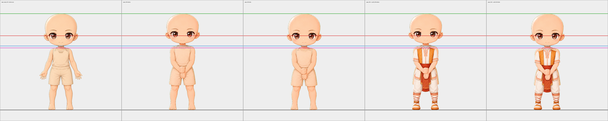
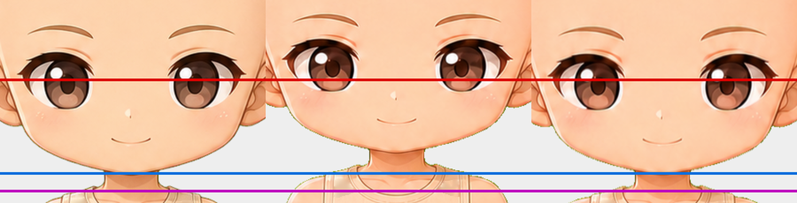

# Pose 005 proportion correction — 2026-09-09

`base_pose_005_centered_two_hand_grip` was drawn to different proportions from the
other four base bodies: a smaller head on a longer body. It has been remapped onto
the collection's anatomy, and `outfit_005_sun_temple_pose_005`, which is drawn to
this base and bound to it by a compatibility rule, took the identical map.

## What was measured

Landmarks are read from the image, not assumed. The eye line is the vertical centre
of the connected dark blob seeded at the darkest pixel near each iris; the chin is
the narrowest silhouette row below the eyes; the shoulder junction is the first row
below the chin at twice the neck's width.

| Base | eye line | chin | shoulder |
|---|---|---|---|
| `base_body_001_neutral_master` | 370.8 | 475 | 497 |
| `base_pose_002_viewer_left_vertical_grip` | 368.5 | 477 | 495 |
| `base_pose_003_viewer_right_vertical_grip` | 370.2 | 477 | 497 |
| `base_pose_004_viewer_left_palm_up` | 371.8 | 477 | 496 |
| `base_pose_005_centered_two_hand_grip` **(before)** | **350.8** | **452** | **472** |
| `base_pose_005_centered_two_hand_grip` **(after)** | 370.0 | 476 | 496 |

The four compliant bases agree within 3.3 px on the eye line and 2 px on the chin
and shoulder. Pose 005 was 19.5, 24.5 and 24.3 px high.

## Why no gate caught it

The rig gate measures the silhouette: canvas size, top of head, foot baseline,
centre X and maximum bounds. All five of those are read at the outline's extremes,
and both vertical extremes are locked to the same rows for every base. Pose 005
passed every check with a full-height figure whose interior anatomy was 24 px out
of position. This is the same blind spot the neck, back and head accessory
re-seating passes ran into: the gates see where a layer's edges are, not what it
sits on.

## Why it had to be fixed rather than tolerated

Eyes, eyebrows and mouths are one layer each, shared by every base and seated by
rig anchor. A pair placed on the collection's eye line lands 20 px below pose 005's
baked eyes, leaving a band of the original eye showing above the new one; a pair
placed for pose 005 sits 20 px high on the other four. There is no seat that serves
both, so 20 % of the collection would have shipped with a broken face. Covering the
baked eyes with a skin patch does not rescue it either — the corrected eyes would
then sit 85 px above pose 005's chin against 109 px on the master, which reads as a
distorted face rather than a different one.

## The correction

A monotone piecewise-linear remap of the Y axis, X untouched:

| source row | target row | meaning |
|---|---|---|
| 141 | 141 | top of head — locked by the rig |
| 350.8 | 370.3 | eye line |
| 452 | 476.5 | chin |
| 472 | 496.3 | shoulder junction |
| 1139 | 1139 | foot baseline — locked by the rig |

The head stretches 9.3 % vertically and the body below the shoulder compresses
3.6 % over 667 px. Only the height moves because only the height was wrong: pose
005's head was already 356 px wide against the master's 353 px. Resampling is
linear on premultiplied alpha, which is what keeps the silhouette edge from
picking up a fringe.

`scripts/refit_pose_005_proportions.py`, recorded by
`scripts/update_pose_005_refit_manifest.py`.

## Verification

- Landmarks after the remap: eye line 370.0, chin 476, shoulder 496 — inside the
  four-base spread on all three.
- Locked rows unchanged: top of head 141, foot baseline 1139.
- `outfit_005` still covers the leg it is drawn over: 0 exposed leg pixels below
  Y 1000, unchanged from the boot-fit pass.
- Chroma spill did not return through the resample: 5 green-dominant pixels in
  7 386 semi-transparent edge pixels.
- Pre-refit bytes retained at
  `incoming/pose_005_refit_2026-09-09/originals/`, hashes recorded in the manifest.
- `tests/test_base_face_anchors.py` now measures these three anchors on every base.

