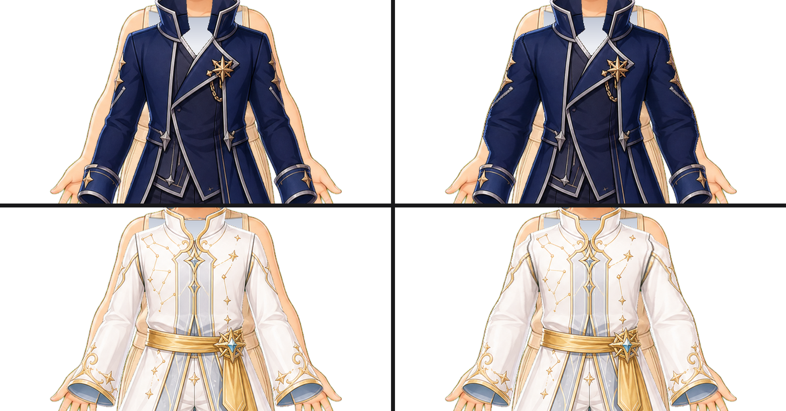

# Sleeve widening — 2026-09-10

Two coats were drawn narrower than the arms they cover, leaving a seam of bare
skin down the outer edge of every sleeve. Both are fixed in the garment layer.

## What was wrong

`outfit_009_navy_high_collar_coat` and `outfit_010_celestial_robe_white_gold`
each left a strip of bare arm running from below the shoulder to the cuff, on
both sleeves. It was a median 14 px on the coat and 13 px on the robe.

| Asset | Bare arm before | After |
|---|---|---|
| `outfit_009_navy_high_collar_coat` | 5193 px over 182 rows | 0 px |
| `outfit_010_celestial_robe_white_gold` | 4482 px over 177 rows | 0 px |

No gate saw it. Canvas, alpha, maximum bounds and the width ratio are all
satisfied by a coat whose sleeves are too narrow, and the exposed-leg gate stops
at the knee. It was found by rendering the outfits over their bound bases and
enlarging the arms.

## The repair

`scripts/widen_sleeves.py` warps the sleeve's outer edge out to the silhouette.
Per row it measures the bare gap inward from the base body's own outer edge,
then remaps the outer 90 px of sleeve: the outermost 8 px — the contour line and
the rim shading behind it — translate as a rigid block, and the fabric behind
them takes up the difference on a ramp that reaches zero at the inner end, so
the join is seamless and the drawn outline is copied rather than resampled.

The shift is a whole number of pixels, because a fractional one spreads a 1 px
contour over two columns and turns a drawn outline into a dotted one.

It stops one pixel short of the silhouette. The art draws the body's outline
outside every garment, so landing on that last column — or past it — puts the
sleeve's own soft edge over the arm's outline and breaks it into dashes.

## What the pass will not touch

- **Above the deltoid.** Every outfit, including the ones with no seam at all,
  sits 30–40 px inside the silhouette across rows 510–535: the base body's
  shoulder cap is wider than any garment drawn for it. Pushing fabric out to
  meet it flattens the shoulder line instead of fixing anything.
- **Below the wrist.** The band ends at each pose's narrowest forearm row,
  measured per base body. Below it the hand takes over the silhouette, and a gap
  measured against the fingers is not a seam. The widening eases off over the
  24 rows above that, because the cuff is already the width of the wrist and
  does not move.
- **A seam that stops short of the cuff.** `outfit_002` and `outfit_005` are
  short-sleeved: the bare arm below the hem is the design. Warping them stretched
  the vest body and cut a hard edge across both shoulder caps.

## Six repairs that did not work

Recorded because each looked right in the code and wrong on the character.

1. **Resampling the whole garment run** across the strip stretched the lapels
   and the coat body along with the sleeve — at the waist the two are one run.
2. **Resampling an outer reach scaled to the gap** moved the stretched zone's
   inner boundary from row to row and tore notches through the lapels.
3. **Repeating the edge pixel** banded the strip horizontally, which is the
   failure the boot pass was written to avoid in the first place.
4. **Averaging that band down its length** turned it into a grey smear, because
   the pixel it repeats is the sleeve's dark contour line, not its fabric.
5. **Carrying the outer margin out over a flat fill** tore the shoulders open
   and laid navy bars across the hands: a per-row search for "any narrow bare
   run touching the silhouette" catches the shoulder cut and the gaps between
   the fingers, not just the sleeve.
6. **Warping only rows whose gap fits a fixed maximum** left horizontal notches
   wherever the gap ran a few pixels wide mid-sleeve. Rows are now grouped into
   runs and the longest run down each arm is taken whole.

## Gate

`tests/test_outfit_sleeves.py` measures the bare strip along every outfit's
sleeve edge and allows 60 px, which is what easing into a cuff leaves. Against
the pre-repair assets it reports 5193 px and 4482 px.
