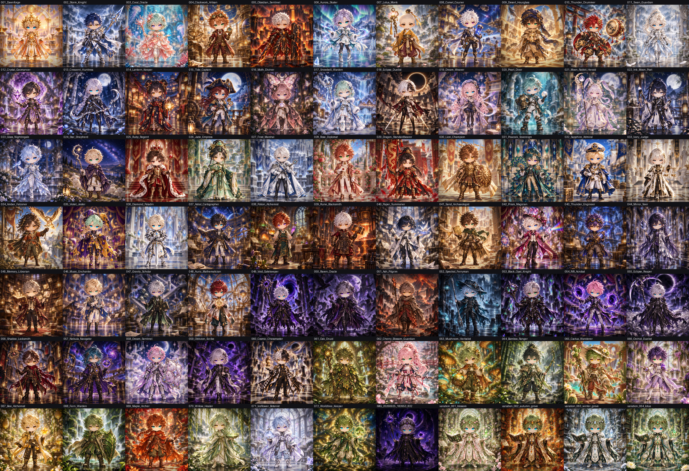

# Final rare 1-of-1 images (2026-10-10)

The official final versions of all 77 rare 1-of-1 illustrations. For each, the original image
gets a focus (lens) blur and a vignette that darkens the corners. The transparent cutout from
[`images/variations/cutouts_2026-10-09/`](../../variations/cutouts_2026-10-09/README.md)
(character, held items, the character's own magic, and foreground items) is then laid on top,
pixel-for-pixel sharp.

High-resolution sheet (6744 × 4604, 600 px per image, labelled): [`contact_sheet_hq.jpg`](contact_sheet_hq.jpg).

| Source | Count | Size |
|---|---:|---|
| `images/variations/complete_72/*.png` | 72 | 1254 × 1254 |
| `images/variations/nature/*.webp` | 4 | 1024 × 1024 (native, not upscaled) |
| `images/variations/references/IMG_20260925_183953_832.jpg` | 1 | 1254 × 1254 |

Outputs are opaque RGB PNGs named after their sources. `manifest.json` records the
parameters and, per image, the SHA-256 of the source, the cutout and the output.

## How each image is made

`python scripts/compose_final_one_of_ones.py` (all images, plus the contact sheet), or pass
one or more names to rebuild only those.

1. **Focus blur.** The original is blurred with a disc-shaped lens kernel (radius 9 px at
   1254 px, scaled for other sizes). Pixels covered by the cutout, plus a 3 px margin, are
   excluded from the blur and the result is renormalised. The character's colours therefore
   never bleed into a halo around the sharp overlay. Where the subject hides a large area, a
   wide blur of the surrounding background fills in behind it.
2. **Vignette.** The blurred background darkens smoothly towards the corners: no change
   inside 38 % of the half-diagonal, 42 % darker at the very corners.
3. **Overlay.** The cutout is alpha-composited on top. Every fully opaque cutout pixel equals
   the source pixel exactly.

Parameters can be changed with `--blur-radius`, `--subject-margin`, `--vignette-strength`,
`--vignette-inner` and `--vignette-power`.

## Review

Every image was checked after compositing. Each region where the cutout keeps pixels the
segmentation model had not kept was compared against the original, 148 regions across 55
images. That review led to these cutout corrections before the final render:

- **044:** all four crystal butterflies over the palm are now kept (two had been missed).
- **040:** the small paper crane is complete.
- **057:** the astrolabe's top loop and gem are complete.
- **061:** the oak staff's shaft, top twigs and five acorns are re-traced, with no pale sky
  between the strands.
- **064:** both foreground lotus flowers follow their petal edges.
- **068:** the cut through the fern frond is removed.
- **All images:** traced edges are now anti-aliased instead of stair-stepped, and colour-key
  corrections fade out at their region border instead of leaving a seam.

These are review candidates. They are not registered as assets and do not change the
generator configuration.
