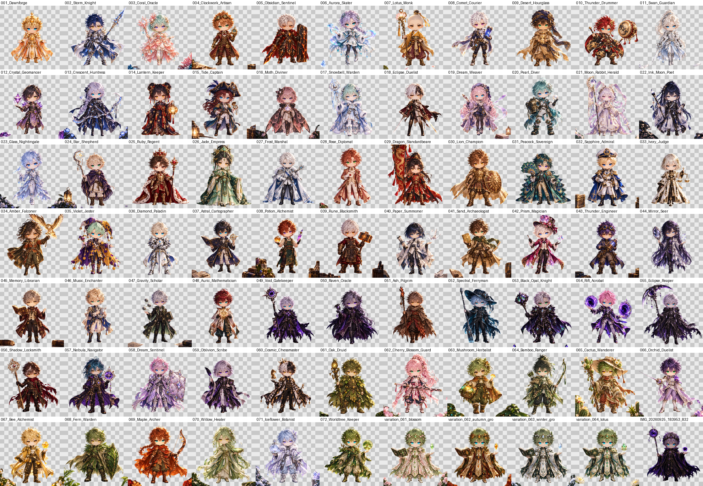

# Transparent cutouts — rare 1-of-1 set (2026-10-09)

All 77 rare 1-of-1 illustrations with the background removed, as RGBA PNGs at each source's
native size (1254 × 1254, or 1024 × 1024 for the four older nature WebPs). Filenames match
the sources.

| Source | Count |
|---|---:|
| `images/variations/complete_72/*.png` | 72 |
| `images/variations/nature/*.webp` | 4 |
| `images/variations/references/IMG_20260925_183953_832.jpg` (copy of legendary 005) | 1 |



Each image was cut out on its own, never batch processed: reviewed at full size and at zoom,
then corrected by hand. Kept: the character, every held item and everything attached to it,
magic the character is producing, and foreground items in front of the character (40 images
have them). Removed: everything else, including the ground. `recipes/NAME.json` records, per
image, what was kept, what was removed, and every correction with its coordinates. The rules
and the tool are in [`docs/qa/background_removal_2026-10-09.md`](../../../docs/qa/background_removal_2026-10-09.md).

Rebuild one image (the two ONNX models are not stored in the repository):

```bash
export CUTOUT_MODELS=/path/to/models CUTOUT_CACHE=/path/to/cache
python scripts/cutout_review.py predict Demigods_001_Dawnforge
python scripts/cutout_review.py render Demigods_001_Dawnforge
```

The final 1-of-1 images composite these cutouts over a focus-blurred, vignetted copy of each original: see
[`images/one_of_ones/final_2026-10-10/`](../../one_of_ones/final_2026-10-10/README.md).

These are review candidates. They are not registered assets and do not change the generator
configuration.
